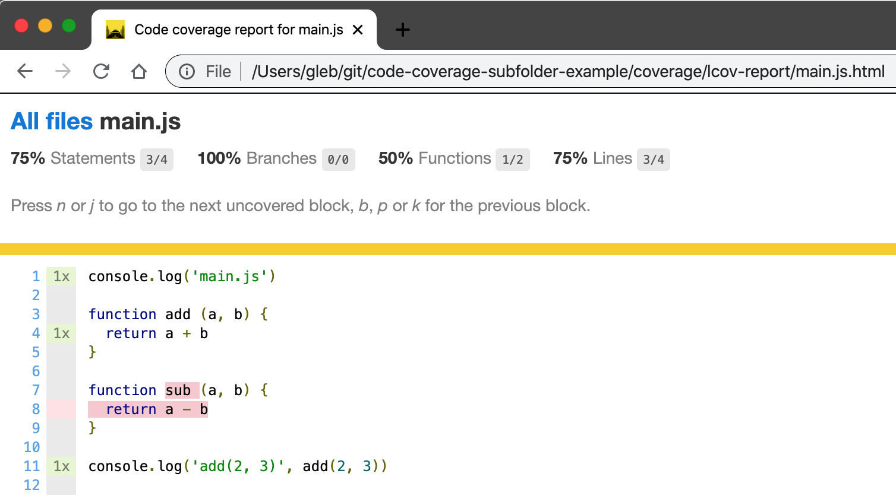

# code-coverage-subfolder-example [![renovate-app badge][renovate-badge]][renovate-app]

The web "app" is located in [app](app) folder. First, you need to instrument it using

```shell
$ npm run cc:instrument
```

The instrumented code is placed into `instrumented` folder, including `index.html` and `main.js`.

Start Cypress with

```shell
$ npm run cypress:open
```

After running the spec file [cypress/integration/spec.js](cypress/integration/spec.js) the coverage information will be saved in `coverage` folder, include HTML report

```shell
$ open coverage/lcov-report/index.html
```



See [Cypress Code Coverage Guide](https://on.cypress.io/code-coverage) and [cypress-io/code-coverage](https://github.com/cypress-io/code-coverage) for more information.

[renovate-badge]: https://img.shields.io/badge/renovate-app-blue.svg
[renovate-app]: https://renovateapp.com/
